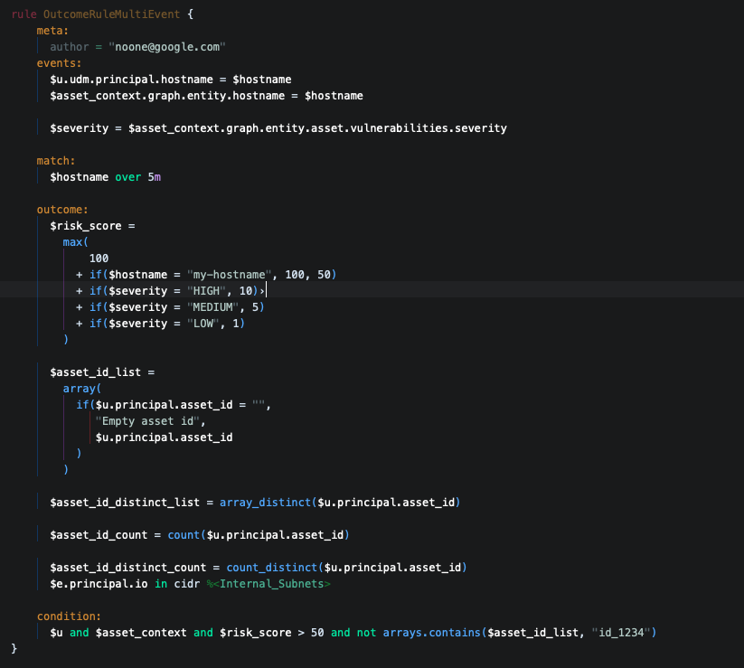

# nova-extension-yara-l-2.0-syntax
Syntax Highlighter extension for YARA-L 2.0 in Nova
=======
<!--
👋 Hello! As Nova users browse the extensions library, a good README can help them understand what your extension does, how it works, and what setup or configuration it may require.

Not every extension will need every item described below. Use your best judgement when deciding which parts to keep to provide the best experience for your new users.

💡 Quick Tip! As you edit this README template, you can preview your changes by selecting **Extensions → Activate Project as Extension**, opening the Extension Library, and selecting "YaraL" in the sidebar.

Let's get started!
-->

<!--
🎈 Include a brief description of the features your syntax extension provides. For example:
-->

**YaraL** provides syntax highlighting and autocompletion for YARA-L 2.0. This is a computer language used to create rules for searching through your enterprise log data as it is ingested into your Chronicle account. The YARA-L syntax is derived from the YARA language developed by VirusTotal. The language works in conjunction with the Chronicle Detection Engine and enables you to hunt for threats and other events across large volumes of data. See also [YARA-L 2.0 language syntax](https://cloud.google.com/chronicle/docs/detection/yara-l-2-0-overview)

<!--
🎈 It can also be helpful to include a screenshot or GIF showing your extension in action:
-->

## Language Support

<!--
🎈 Whether your extension covers the entirety of a language's syntax or a subset, it can be helpful to describe that for users:
-->

YaraL currently supports the following features of Important Language:

- Highlighting syntax of YaraL
- Customize color schema of YaraL

Support for:
- Auto complete
- Validate rule and syntax

is planned for a future update.

<!--
👋 That's it! Happy developing!

P.S. If you'd like, you can remove these comments before submitting your extension 😉
-->

## Manual Install

1. Download this project as zip file and unzip it
2. Rename the folder unzipped into YaraL.novaextension
3. Open this folder with Nova
4. Click Extensions -> Active Project as Extension
5. In yaral file, choose Editor in Menu -> Syntax -> YaraL
6. In Extensions menu, choose Extension Library -> Configure Themes -> select YaraL theme
